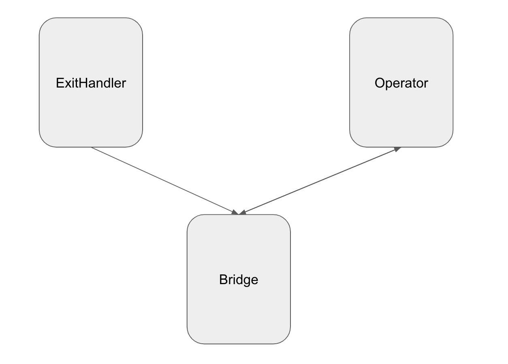
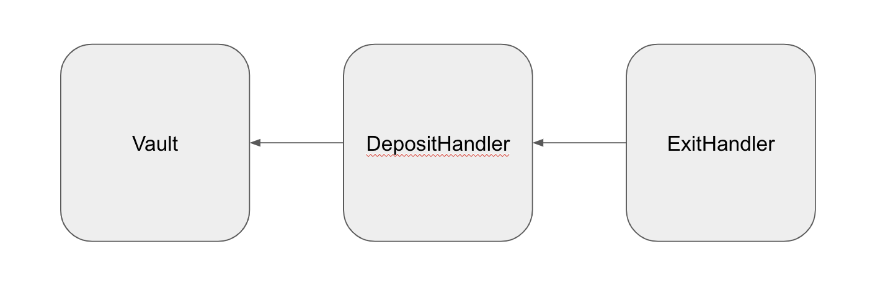

# LeapDAO Bridge implementation
[](https://travis-ci.org/leapdao/leap-contracts)
# Development

## Getting started

```
yarn
yarn test 
```

## Deploying contracts

> All the commands support any truffle options like `--network` or `--reset`.


Contract may be customized via ENV variables:

| ENV variable | Description | Default value |
| ------- | ----------- | ------------- |
| PROPOSAL_TIME | Governance proposal cool-off time (in seconds) | `1209600` (14 days) |
| EXIT_STAKE | Exit stake (in Wei) |100000000000000000|
| EXIT_DURATION | Exit duration (in seconds) |`604800` (7 days)|
| DEPLOYED_TOKEN | Token to be configured in vault | |
| EPOCH_LENGTH | Number of initial slots for validators | 2 |
| PARENT_BLOCK_INTERVAL | Number of Ethereum blocks between Plasma periods | 2 |
| TAX_RATE | Initial tax rate (0 - 1000 equals 0% - 100%) | 50 |
| POA_REWARD | Reward rate before supply of 7 million reached | 778000000000000000000 |
| GOV_OWNER | Owner address of the `MinGov.sol` contract, should be set to seed initial token supply. | |


E.g. `PROPOSAL_TIME=600 EXIT_DURATION=180 yarn deploy` deploys plasma contract with 3 minutes exit duration governed by MinGov with 10 minutes proposal time.

### Deploy everything

```
yarn deploy
```

This will deploy deploy token, plasma and governance contracts.

### Deploy only plasma and governance contracts (reusing token)

```
yarn deploy:plasma
```

### Good things to know

`slotId` in `MinGov.setSlot` is encoded like this:

| First 20 bytes  | last 12 bytes |
| ---------------------- | ------ |
| address(OperatorProxy) | slotId |


# Contracts

In this repository are the solidity smart contracts implementing LeapDAO's plasma leap. 

There are 3 smart contracts that get deployed:

* Bridge

  The bridge is responsible for storing the period chain. It is the source of truth for the plasma chain.

* Operator

  The operator is the contract that is responsible for submitting new periods to the bridge.

* ExitHandler

  This contract is responsible for user funds. Explained in more detail below.



The ExitHandler is actually the final contract in an inheritance chain that goes as follows:

* Vault 

  The vault defines what types of assets are allowed on the plasma chain and is responsible for registration of these assets.

* DepositHandler

  The deposit handler is in general responsible for how funds get onto the plasma chain.

* ExitHandler

  The exit handler is in general responsible for how funds leave the plasma chain.



## LICENSE

Project source files are made available under the terms of the Mozilla Public License (MPLv2). See individual files for details.
